# 📱 Telegram URL Scraper 🔍

[](https://www.python.org/)
[](https://flask.palletsprojects.com/)
[](https://pandas.pydata.org/)

> **Try it online:** [Telegram URL Extractor](https://telegram-url-extracter-wuv6jff7zq-de.a.run.app/)

## 📋 Overview

This repository provides a set of tools to extract URLs from your Telegram chat history. You can use this tool to:

- 📤 Export your Telegram user, group, or chat history in JSON format
- 📝 Extract text messages from your chat history
- 🔗 Extract all available URLs in your Telegram chats
- 📊 Generate a CSV file for further analysis


## 📑 Table of Contents

- [Prerequisites](#prerequisites)
- [Getting Started](#getting-started)
  - [Exporting Telegram Data](#exporting-telegram-data)
- [Usage](#usage)
  - [Extracting URLs and Creating a CSV](#extracting-urls-and-creating-a-csv)
- [Contributing](#contributing)
- [License](#license)

## 🔧 Prerequisites

Before using this tool, ensure you have the following installed on your system:

| Requirement | Version | Purpose |
|-------------|---------|---------|
| [Telegram Desktop](https://desktop.telegram.org/) | Latest | For exporting chat history |
| [Python](https://www.python.org/) | 3.7+ | Runtime environment |
| pandas | Latest | Data handling and CSV creation |
| Flask | 3.0.0 | Web interface (optional) |

## 🚀 Getting Started

### Exporting Telegram Data

```mermaid
graph TD
    A[Install Telegram Desktop] --> B[Open Telegram Desktop]
    B --> C[Go to target chat]
    C --> D[Click profile picture]
    D --> E[Click three dots ⋮]
    E --> F[Select Export chat history]
    F --> G[Choose JSON format]
    G --> H[Save .json file]
```



To export your Telegram chat history, follow these steps:

1. **Install Telegram Desktop** on your computer if you haven't already.

2. **Open Telegram Desktop** and log in with your account.

3. **Go to the chat or group** you want to export and click on the profile picture.

4. **In the chat/group profile**, click on the three vertical dots (⋮) in the top-right corner and select "Export chat history."

5. **Choose the "JSON" format** for exporting the chat history. Save the resulting `.json` file to a location on your computer.

### 📊 Analyzing Telegram Data

Clone this repository to your local machine and navigate to the repository directory.

```bash
git clone https://github.com/Yash-Kavaiya/telegram-url-scraper
cd telegram-url-scraper
```

## 💻 Usage

### Extracting URLs

To extract URLs from the exported Telegram data and create a CSV file, run the following command:

```bash
python app.py -i result.json
```

Replace `result.json` with the path to your exported Telegram chat history JSON file. This command will:

1. 📂 Load your Telegram chat history
2. 🔍 Extract all URLs from messages
3. 🧹 Clean and format the URLs
4. 📊 Generate a CSV file with the results

### 🌐 Web Interface

This tool also provides a web interface for easier use:

1. **Start the web server**:
   ```bash
   python app.py
   ```

2. **Open your browser** and go to `http://localhost:5000`

3. **Upload your JSON file** and follow the on-screen instructions

## 🔄 Data Processing Flow


## 🧩 Key Components

| Component | Description |
|-----------|-------------|
| **JSON Parser** | Processes the exported Telegram JSON file |
| **URL Extractor** | Uses regex patterns to identify and extract URLs |
| **Data Cleaner** | Removes unwanted characters and formats URLs |
| **CSV Generator** | Creates structured output files for analysis |
| **Web Interface** | Provides a user-friendly way to use the tool |

## 🤝 Contributing

If you have improvements or additional features to add to this project, feel free to contribute:

1. **Fork the repository**
2. **Create a feature branch**:
   ```bash
   git checkout -b feature/amazing-feature
   ```
3. **Commit your changes**:
   ```bash
   git commit -m "Add some amazing feature"
   ```
4. **Push to the branch**:
   ```bash
   git push origin feature/amazing-feature
   ```
5. **Open a Pull Request**

## 📄 License

This project is licensed under the MIT License - see the [LICENSE](LICENSE) file for details.

---

<div align="center">
  <p>🔍 <b>Telegram URL Scraper</b> - Extract, analyze, and utilize links from your Telegram chats with ease! 📊</p>
</div>
